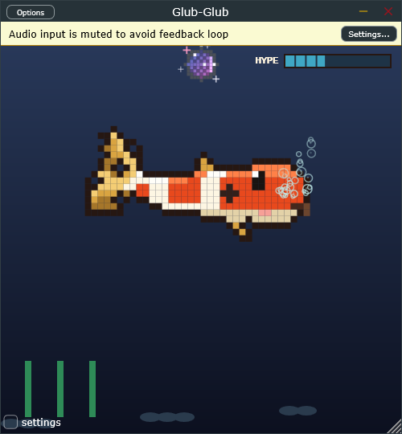
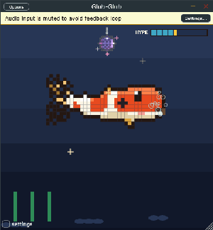

# Glub-Glub 🐟



**Glub-Glub** is a cute pixel koi fish who lives in your signal chain. He is a
fully transparent VST3 effect — your audio passes through untouched — but any
sound that goes through him makes him dance. Add him to a track in Ableton
(or any DAW), hit play, and he bobs to the beat, undulates, flips on drops,
and throws a full disco party when the music gets wild. Run the standalone
`.exe` with no DAW at all and he just chills in his tank.



## Features

- **Transparent audio passthrough** — zero DSP on your sound, zero latency added, any channel count
- **Kohaku pixel koi** — white body, orange-red patches, sumi spots, 3-tone shading for a near-3D pixel look
- **Beat-locked dancing** — bobs exactly on quarter notes via the host BPM hook (Ableton etc.); free-dances from audio analysis when no BPM is available
- **Full move set** — traveling-body undulation, on-beat bob, tail spins every 4th bar, flip-arounds on drops, eased 360° party spin every 8 bars
- **Party tier** — pixel disco ball (rotating facets, sweeping specular highlight, twinkling rim stars) at medium hype, beat-stepped RGB water tint at high hype (smooth drift when no BPM)
- **Idle life** — mouth bubbles, breathing, sleepy ZZZ mode after ~6 seconds of silence
- **Cute speech** — tiered fish-pun lines (idle / low / medium / high energy), roughly once per minute by default, configurable
- **HYPE meter** — segmented top-right bar tracking energy + beat + intensity in real time

## Install

1. Build (below), then copy the plugin folder:

```
C:\Program Files\Common Files\VST3\   (copy Glub-Glub.vst3 here)
```

2. Or just run the standalone: `Glub-Glub.exe` (pick an audio input in its settings if you want him to react to your mic/system audio).

## Build (Windows + MSVC)

Requires VS 2022 Build Tools with the C++ workload and CMake 3.22+.

```cmd
scripts\build-windows.bat
```

Outputs:

- VST3: `build-msvc\GlubGlub_artefacts\Release\VST3\Glub-Glub.vst3`
- Standalone: `build-msvc\GlubGlub_artefacts\Release\Standalone\Glub-Glub.exe`

### Demo mode

Wants to see him dance without routing audio? Build the demo variant:

```cmd
scripts\build-demo.bat
```

It synthesizes a 128 BPM kick/hat groove **internally** to drive the visuals.
Your audio output stays completely transparent — the demo groove only feeds
the animation engine.

## Usage

- **In a DAW**: insert on any track, press play. He reads the host BPM and bobs on the grid.
- **Standalone**: launch the exe, play music into the selected input device.
- **Settings drawer** (bottom-left, click `settings`):
  - *speech (s)* — speech bubble frequency, 30–90s (default ~60s)
  - *vibe* — overall dance sensitivity (0.2–2.0)
  - *hue* — tank water color shift
  - *bubbles* — toggle idle mouth bubbles

## How the dancing works

```
audio ──▶ AudioFeatures (RMS envelope, onset flux, brightness)
              │
              ▼
        VibeState (energy, pulse, brightness, intensity, host BPM/beat phase)
              │ lock-free atomics
              ▼
        KoiFish (spine-driven pixel body: undulation, bob, spins, flips)
        DiscoBall / RGB tint (party tier) · Bubbles · SpeechBox · HypeMeter
```

- The **body** is generated from a bending spine: fat head, tapering tail,
  weld-connected fan tail. The traveling wave moves head-to-tail so the tail
  whips while the head (and bubble origin) stays anchored.
- The **bob** is `(1 - beatPhase)^1.5` — exactly one dip per quarter note,
  hitting on the beat, using the host's PPQ position.
- The **disco ball** drops in when hype (energy·0.5 + pulse·0.3 + intensity·0.1, ×1.15)
  exceeds 45% and holds until it has been below 60% for 500 ms.
- The **RGB tint** eases in above 70% hype, hue-jumping on each host beat.
  Alpha is capped at ~14% so it never flash-bangs.

## Project layout

```
Source/
  PluginProcessor.{h,cpp}   transparent effect + parameters + vibe state
  PluginEditor.{h,cpp}      500x500 resizable tank, 60 fps timer
  DSP/AudioFeatures.*       allocation-free analysis (audio thread)
  DSP/VibeState.h           lock-free atomic state
  UI/KoiFish.*              spine-driven pixel koi (offscreen-rendered)
  UI/DiscoBall.*            party ball
  UI/Bubbles.*              mouth bubble particles
  UI/SpeechBox.*            tiered cute speech
  UI/HypeMeter.*            segmented hype bar
  UI/ConfigDrawer.*         collapsible settings
scripts/
  build-windows.bat         standard release build (MSVC + Ninja)
  build-demo.bat            demo-mode build (synth-driven visuals)
  capture-demo.ps1          window frame capture (screenshots/GIF source)
  makegif.js                frames -> GIF (pngjs + gifenc)
```

## Repo branches

- `main` — stable line
- `experimental` — WIP tuning; merged to `main` when it feels good

Built with [JUCE 8](https://juce.com/) and a lot of glubs.
