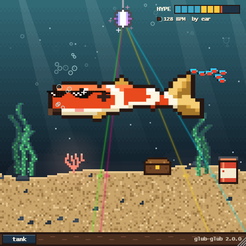
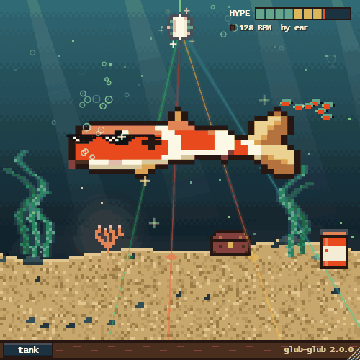
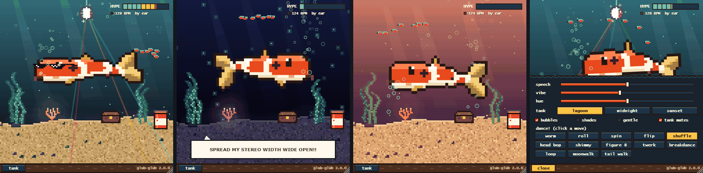
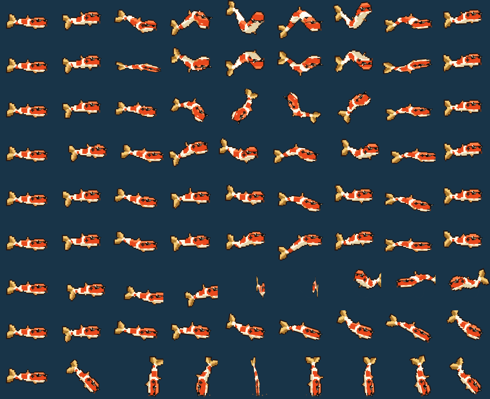

# Glub-Glub 🐟



**Glub-Glub** is a cute pixel koi fish who lives in your signal chain. He is a
fully transparent VST3 effect — your audio passes through untouched — but any
sound that goes through him makes him dance. Add him to a track in Ableton
(or any DAW), hit play, and he bobs to the beat, undulates, flips on drops,
and throws a full disco party when the music gets wild. Run the standalone
`.exe` with no DAW at all and he just chills in his tank.



## What's new in 2.0



- **He hears the beat himself.** A tempo tracker (onset autocorrelation + comb-filter
  phase) locks to the music in the standalone app or a stopped DAW, with no host clock.
  The HYPE meter shows the BPM and where it came from (`host` / `by ear`) with a beat light.
- **Every dance move rebuilt** (except the Worm, which was already perfect). Each move now
  bends the pixel body itself with a smooth envelope, one gesture per beat, like the Worm:
  a true belly-up barrel roll, a C-curl pirouette, beat-stepped shuffles, a head-banging
  bop, a shimmy-down-shimmy-up, a figure eight that turns to face where it's going, and a
  visible breakdance headspin.
- **New moves:** loop-de-loop (with a bubble wake), moonwalk (slides backwards while his tail
  swims forwards), and a dolphin tail walk with splashes.
- **Max hype = showstoppers.** Once hype has been pegged for a few seconds he dances every bar
  from an intense set (loop, tail walk, roll, twerk, spin, worm), and breakdances on his own
  now and then, at most every 16 s.
- **Steadier disco ball.** It needs sustained hype to drop in, stays at least 8 s, and only
  leaves after a real lull, so it no longer pops in and out.
- **A living tank.** Pixel-art water, sand, rocks, coral and a sunken chest. Seaweed pumps with
  the bass and snaps on kicks, coral glows with the mids, and light rays and plankton shimmer
  with the highs. The chest burps a bubble every eighth kick.
- **Three themes:** Lagoon, Midnight (bioluminescent), Sunset.
- **Tank mates:** a school of neon tetras that wander, dodge the koi, and scatter on kicks.
- **He eats!** Food settles on the sand, and Glub turns around, swims his mouth to each flake
  and gulps it, with love hearts, a rounder belly, and opinions about the flavour.
- **New control panel** in chunky pixel style. It slides up over the tank without resizing it,
  and each move gets a one-click button that lights up while it plays.
- Faster rendering (the koi sprite buffer shrank from window-sized to grid-sized), and a tail
  fix: at full energy the fan used to break into a dark outline lattice.



## Features

- **Transparent audio passthrough** — zero DSP on your sound, zero latency added, any channel count
- **Kohaku pixel koi** — white body, orange-red patches, sumi spots, 3-tone shading for a near-3D pixel look
- **Beat-locked dancing** — bobs exactly on quarter notes via the host BPM hook (Ableton etc.); free-dances from audio analysis when no BPM is available
- **Thirteen dance moves** — worm, barrel roll, spin, flip, shuffle, head bop, shimmy, figure eight, a beat-synced twerk, a breakdance headspin-to-freeze, a loop-de-loop, a moonwalk, and a dolphin tail walk. Automatic choreography gives bigger tricks room to breathe; manual requests queue after the current move.
- **Connected pixel rendering** — the body and glasses share one transform, keeping stretched pixels connected and the glasses attached through rolls and flips.
- **Party tier** — pixel disco ball (rotating facets, sweeping specular highlight, twinkling rim stars) at medium hype, beat-stepped RGB water tint at high hype (smooth drift when no BPM)
- **Idle life** — mouth bubbles, breathing, sleepy ZZZ mode after ~6 seconds of silence
- **Cute speech** — tiered fish-pun lines (idle / low / medium / high energy), roughly once per minute by default, configurable
- **HYPE meter** — segmented top-right bar tracking energy + beat + intensity in real time

## Install

1. Build (below), then copy the plugin folder:

```
C:\Program Files\Common Files\VST3\   (copy Glub-Glub.vst3 here)
```

2. Or just run the standalone: `Glub-Glub.exe` (pick an audio input in its settings if you want him to react to your mic/system audio).

## Build (Windows + MSVC)

Requires VS 2022 Build Tools with the C++ workload and CMake 3.22+.

```cmd
scripts\build-windows.bat
```

Outputs:

- VST3: `build-msvc\GlubGlub_artefacts\Release\VST3\Glub-Glub.vst3`
- Standalone: `build-msvc\GlubGlub_artefacts\Release\Standalone\Glub-Glub.exe`

### Demo mode

Wants to see him dance without routing audio? Build the demo variant:

```cmd
scripts\build-demo.bat
```

It synthesizes a 128 BPM kick/hat groove **internally** to drive the visuals.
Your audio output stays completely transparent — the demo groove only feeds
the animation engine.

## Usage

- **In a DAW**: insert on any track, press play. He reads the host BPM and bobs on the grid.
- **Standalone**: launch the exe, play music into the selected input device.
- **Feed him**: drag the red canister over the water and shake it.
- **Tank panel** (bottom-left, click `tank`; click the water to close):
  - *speech* — speech bubble frequency, 30–90s (default ~60s)
  - *vibe* — overall dance sensitivity (0.2–2.0)
  - *hue* — fine water colour shift on top of the theme
  - *tank* — Lagoon / Midnight / Sunset
  - *bubbles*, *shades* (Deal With It glasses), *gentle* (less travel, no full rotations), *tank mates*
  - *dance!* — thirteen move buttons; a move you click waits for the current one to land and starts on the next downbeat

Moves pick up a downbeat when host timing is available. Rolls, spins, and worms
span four beats; the twerk and full figure eight span eight. The whole-body bounce
lands with a squash on the beat and lifts between beats. Glasses use a larger fit
while keeping the same face anchor.

Glasses and gentle-motion settings are saved with the plugin state. Hype now uses
the loudness envelope before the vibe sensitivity control. Sustained loud passages
can reach maximum; a loud drop builds faster, while isolated peaks and food alone
cannot peg the meter. Without host tempo, beat-based moves use a 120 BPM fallback.

## How the dancing works

```
audio ──▶ AudioFeatures (RMS envelope, onset flux, brightness)
              │
              ▼
        VibeState (energy, pulse, brightness, intensity, host BPM/beat phase)
              │ lock-free atomics
              ▼
        KoiFish (spine-driven pixel body: undulation, bob, spins, flips)
        DiscoBall / RGB tint (party tier) · Bubbles · SpeechBox · HypeMeter
```

- The **body** is generated from a bending spine: fat head, tapering tail,
  weld-connected fan tail. The traveling wave moves head-to-tail so the tail
  whips while the head (and bubble origin) stays anchored.
- The **bob** uses a continuous cosine cycle with one dip per quarter note,
  avoiding a position jump when the host's beat phase wraps back to zero.
- The **hype envelope** builds from musical loudness with a nonlinear threshold,
  faster response to loud drops, and a smooth release. The disco ball responds to
  that envelope.
- The **RGB tint** eases in above 70% hype, hue-jumping on each host beat.
  Alpha is capped at ~14% so it never flash-bangs.

## Project layout

Checks (configure with `-DGLUB_BUILD_MOTION_CHECKS=ON`):

- `KoiMotionChecks` (`scripts\check-motion.bat`): move continuity and queueing, beat timing,
  hype ballistics, food chasing, tail solidity; writes move previews and per-move frames to
  `build-msvc/motion-review`.
- `DspChecks`: tempo lock within 1.5 BPM and beat phase at 90–174 BPM (44.1/48 kHz),
  release on silence, no false lock on noise, band levels and the kick detector.
- `EditorShots`: runs the real processor and editor offscreen on a synthetic groove,
  saves each theme, feeding and the open panel to `build-msvc/editor-shots`, and
  times a full 1024×1024 frame.

```
Source/
  PluginProcessor.{h,cpp}   transparent effect + parameters + vibe state
  PluginEditor.{h,cpp}      500x500 resizable tank, 60 fps timer
  DSP/AudioFeatures.*       allocation-free analysis: envelope, 3 bands, kick (audio thread)
  DSP/TempoTracker.*        onset-autocorrelation BPM + beat phase, no host needed
  DSP/VibeState.h           lock-free atomic state
  UI/KoiFish.*              spine-driven pixel koi: move state machine, food chase
  UI/TankScene.*            themed pixel tank, band-reactive scenery, tetras, party layer
  UI/DiscoBall.*            party ball
  UI/Bubbles.*              mouth bubble particles
  UI/SpeechBox.*            tiered cute speech
  UI/HypeMeter.*            segmented hype bar
  UI/ControlPanel.*         slide-up settings + move buttons
  UI/PixelLookAndFeel.h     chunky pixel controls
  UI/FoodShaker.*           draggable food canister + pellets
scripts/
  build-windows.bat         standard release build (MSVC + Ninja)
  build-demo.bat            demo-mode build (synth-driven visuals)
  capture-demo.ps1          window frame capture (screenshots/GIF source)
  makegif.js                frames -> GIF (pngjs + gifenc)
```

## Repo branches

- `main` — stable line
- `experimental` — WIP tuning; merged to `main` when it feels good

Built with [JUCE 8](https://juce.com/) and a lot of glubs.
